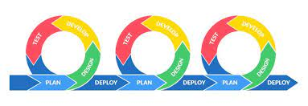
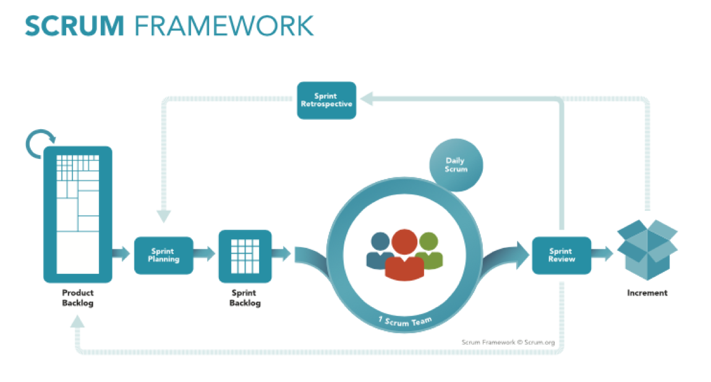

# Eng130_Week 1 

### Elevator's Pitch
-An elevator pitch is a  way of introducing yourself, should only take max 2 minutes, roughly the same time as an elevator ride
-Should highlight achievements and express interest in the role applied for.

### What is Agile?
- Agile is a methodology where projects are split into short increments where feedback is always given and product is continuously improved whilst still being created
- Gives the ability to create and respond to change as fast as possible
- Increases product quality
- Increases customer satisfaction
- Increased adaptability

### What is Scrum?
- A framework that aids multiple teams to work together to deliver complex solutions
- Quicker releases of useable products
- Higher productivity
- Lower costs

### How to install Python
Head to https://www.python.org/downloads/ and download the latest save the application locally.

### How to install PyCharm
Head to https://www.jetbrains.com/pycharm/download/#section=windows and download the relevant version for your OS

How to add a variable to your path

### What is DevOps
- DevOps is a set of practices that combines software development and IT operations. 
- It aims to shorten the systems development life cycle and provide continuous delivery with high software quality. 
- DevOps is complementary with Agile 

### The role of a devops engineer
- A devops engineer is responsible for the smooth operation of a companies IT infrastrructure.
- They work with developers to deploy and manage changes in code
- Work with operatioons team to make sure the systems are running smoothly
- A devOps engineer must have a deep understanding of both development and operations processes and also technical knowledge.

### How does DevOps benefit a business
- Can bring consistent improvements in systems qualities
- better quality projects completed
- reduces costs
- increase in customer satisfaction
- improved collaboration between teams

### How to make a good elevator pitch
Your elevator pitch should be:
- Brief - no more than 90 seconds
- Mention your goals
- Speak to the audience - look at the camera
- Be persuasive - use hand gestures and smile
- PRACTICE

### SDLC 

# Week 2 - Python

#print("hello world")
#Variables
#- Used to store any data / user date
#-anything in quotation marks is a string
#-any number is a integer
#-yes or no is Boolean
#-if you have a number with a decimal it is a float

#How to find out the type of data stored
#-type()
#-print(type(variable name))

first_name = "Mohamed"
last_name = "Osman"
DOB = "05/05/1998"
Course_name = "Eng130"
uk_resident = bool

print("Hello, What is your name")
first_name = input()
print("Please enter your last name")
last_name = input()
print("Nice to meet you", first_name, last_name)

print("What is your date of birth")
DOB = input()

print("Are you a UK resident?")
uk_resident = input()
